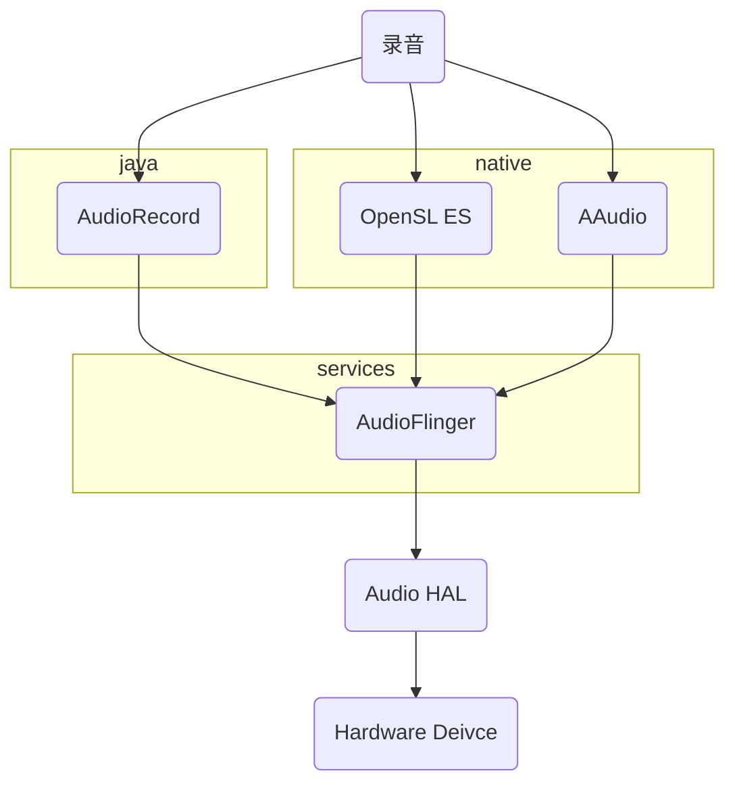
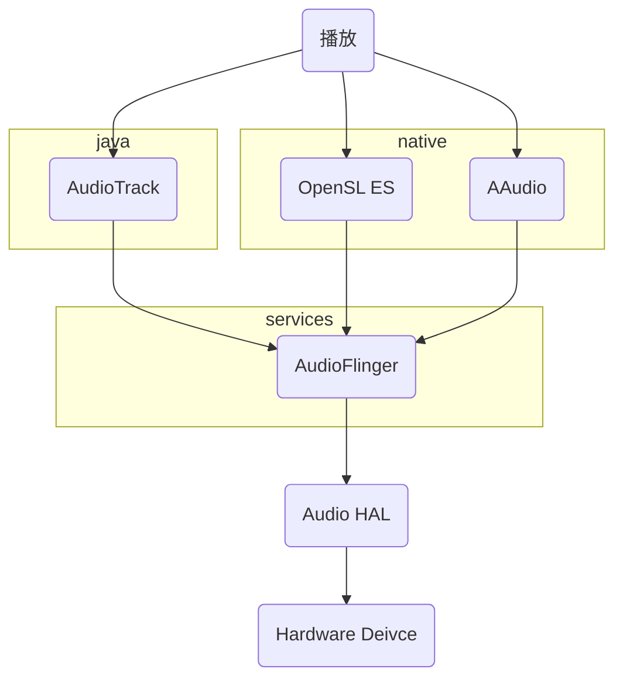

[toc]

### Android 音频架构

#### 应用框架

应用框架包含应用代码，该代码使用 [android.media](http://developer.android.com/reference/android/media/package-summary.html) API 与音频硬件进行交互。在内部，此代码会调用相应的 JNI 粘合类来访问与音频硬件互动的native代码。

#### JNI

与 [android.media](http://developer.android.com/reference/android/media/package-summary.html) 关联的 JNI 代码会调用较低级别的原生代码来访问音频硬件。JNI 位于 `frameworks/base/core/jni/` 和 `frameworks/base/media/jni` 中。

#### 原生框架

原生框架提供相当于 [android.media](http://developer.android.com/reference/android/media/package-summary.html) 软件包的原生软件包，它调用 Binder IPC 代理来访问媒体服务器的音频专属服务。 原生框架代码位于 `frameworks/av/media/libmedia` 中。

#### Binder IPC

Binder IPC 代理用于促进跨越进程边界的通信。代理位于 `frameworks/av/media/libmedia` 中，并以字母“I”开头。

#### 媒体服务器

媒体服务器包含音频服务，这些音频服务是与HAL 实现进行交互的实际代码。媒体服务器位于 `frameworks/av/services/audioflinger` 中。

#### HAL

HAL 定义了音频服务会调用且必须实现才能使音频硬件正常运行的标准接口（可参阅[音频 HAL 接口](https://android.googlesource.com/platform/hardware/interfaces/+/refs/heads/master/audio/)并查看相应 HAL 版本目录的 `*.hal` 文件中的注解）。

#### 内核驱动程序

音频驱动程序用于同硬件和 HAL 实现进行交互。可以使用高级 Linux 声音架构 (ALSA)、开放声音系统 (OSS) 或自定义驱动程序（HAL 与驱动程序无关）。

### Android 录音与播放

#### 录音方式

##### AudioRecord

#### 播放方式

